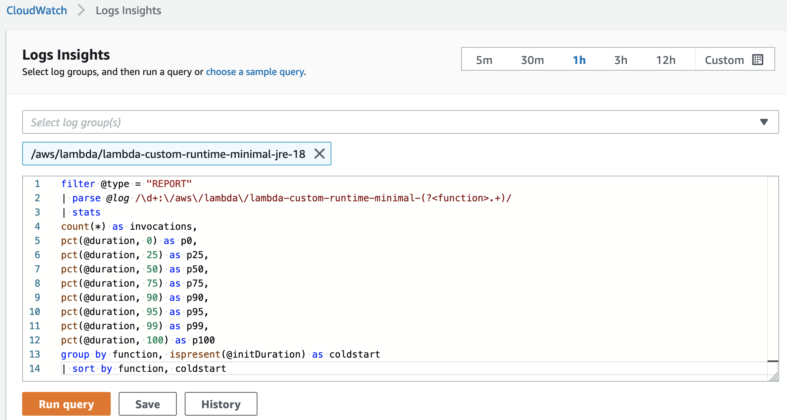

# AWS Lambda Custom Runtime based on minimal Java 18 JRE (OpenJDK)
An AWS Lambda custom runtime to enable Java 18 support on a minimalistic JRE, which only includes the Java modules required by this function.

## Getting started

Download or clone the repository.

To install prerequisite software:

1. Install [AWS CDK](https://docs.aws.amazon.com/cdk/latest/guide/getting_started.html)
2. Install [Docker](https://docs.docker.com/get-docker/)

3. Build and package the AWS Lambda function and create the AWS Lambda custom runtime using Docker:

```bash
./build-lambda-custom-runtime-minimal-jre-18.sh
```

The script does the following tasks for the x86 platform:  
  a) use the latest Amazon Linux 2 image and install an early access version of OpenJDK 18
  b) copy the software directory into the Docker container and run the build using Maven, which create an uber jar  
  c) run jdeps to calculate the Java module dependencies for this uber jar  
  d) feeding the jdeps output into jlink, creating a minimal Java 18 JRE which only contains the necessary modules to run this jar  
  f) create the runtime.zip archive, based on the AWS Lambda custom runtime specification  
  g) extracts the runtime.zip archive from the Docker image into your project root directory  

4. Provision the AWS infrastructure (mainly Amazon API Gateway, AWS Lambda and Amazon DynamoDB) using AWS CDK:

```bash
./provision-infrastructure.sh
```

The API Gateway endpoint URL is displayed in the output and saved in the file `infrastructure/target/outputs.json`. The contents are similar to:

```
{
  "LambdaCustomRuntimeMinimalJRE18InfrastructureStack": {
    "apiendpoint": "https://<API_ID>.execute-api.<AWS_REGION>.amazonaws.com"
  }
}
```


## Using Artillery to load test the changes

First, install prerequisites:

1. Install [jq](https://stedolan.github.io/jq/) and [Artillery Core](https://artillery.io/docs/guides/getting-started/installing-artillery.html)
2. Run the following two scripts from the projects root directory:

```bash
artillery run -t $(cat infrastructure/target/outputs.json | jq -r '.LambdaCustomRuntimeMinimalJRE18InfrastructureStack.apiendpoint') -v '{ "url": "/custom-runtime-jre-18" }' infrastructure/loadtest.yml
```


### Check results in Amazon CloudWatch Insights

1. Navigate to Amazon **[CloudWatch Logs Insights](https://console.aws.amazon.com/cloudwatch/home?#logsV2:logs-insights)**.
2.Select the log groups `/aws/lambda/lambda-custom-runtime-minimal-jre-18` from the drop-down list
3. Copy the following query and choose **Run query**:

```
filter @type = "REPORT"
| parse @log /\d+:\/aws\/lambda\/lambda-custom-runtime-minimal-(?<function>.+)/
| stats
count(*) as invocations,
pct(@duration, 0) as p0,
pct(@duration, 25) as p25,
pct(@duration, 50) as p50,
pct(@duration, 75) as p75,
pct(@duration, 90) as p90,
pct(@duration, 95) as p95,
pct(@duration, 99) as p99,
pct(@duration, 100) as p100
group by function, ispresent(@initDuration) as coldstart
| sort by function, coldstart
```



You see results similar to:


## Security

See [CONTRIBUTING](CONTRIBUTING.md#security-issue-notifications) for more information.

## License

This library is licensed under the MIT-0 License. See the LICENSE file.
